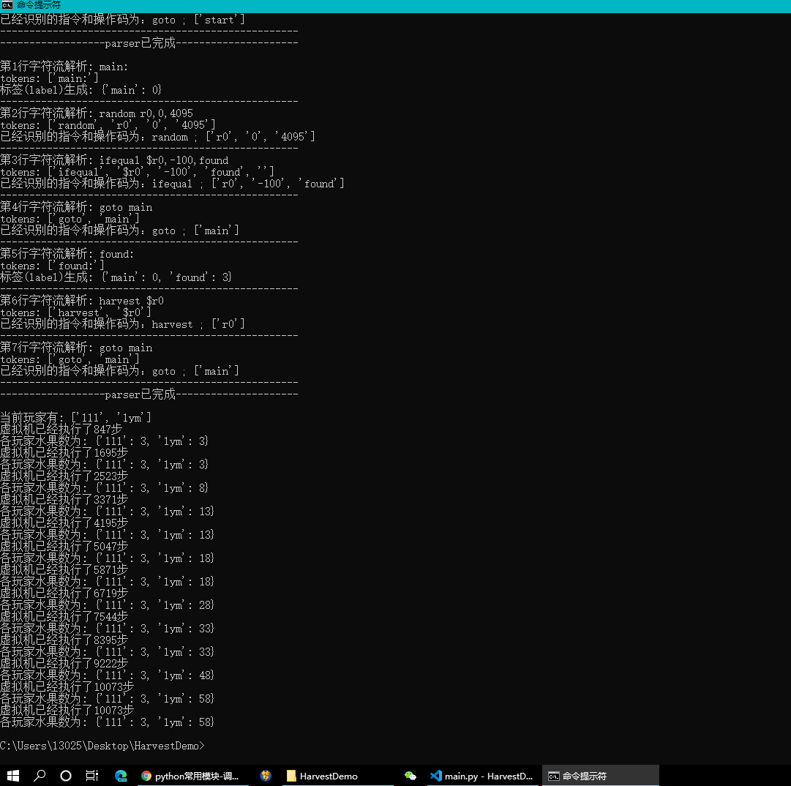

# HarvestMemory----汉化版：内存水果小游戏

由Austin Henley为田纳西大学软件工程课程编写的编程游戏。在原版，它是一个图形化Python应用程序，需要所有玩家的源代码都在本地才能执行，并且最多支持30个播放器。

游戏的目的是收获比任何其他玩家更多的“水果”。每个玩家都用汇编语言编写程序。每个程序都可以访问共享内存，在共享内存中它们可以 _plant_ 和 _harvest_ 水果。

### 原版本是GUI界面，汉化版用的是终端形式(特别简陋,改进中)

### 重申一下，去掉原版中的GUI只是为了让我的朋友入门源代码更加容易

## 水果

内存中的水果用-100表示​​。 _收获_水果将使您当前的水果得分提高+5。尝试收获不包含水果的位置会导致CPU模拟器对程序的惩罚。

您也可以种水果。这会将内存值设置为-1，并将在每个CPU周期自动减1。一旦值达到-100，它将成为可收获的水果。

将该值设置为任意正值可以破坏内存中的水果。

所有玩家都从3个水果开始。

游戏以随机分组放置在内存中的水果开始。这些组是根据指数衰减函数计算的(例如0.75 ^ x，其中x是初始存储位置加上/减去偏移量)。这意味着多个水果可能彼此之间的距离在1-5之间，尽管它们可能相距15。

## CPU 模拟器

CPU使用轮询算法。在游戏开始时，它会随机洗牌。每个玩家将执行1条指令。如果指令占用的周期超过1个周期(大多数情况下都如此)，则该播放器的程序将不会再次执行，直到为所有其他播放器的程序提供了至少相同数量的循环。

例如：如果玩家A的回合花费1个周期，而玩家B的回合花费10个周期，那么玩家B将被跳过，直到玩家A至少再花费9个周期(各自回合消耗的周期之间的差额) 。

## CPU体系结构

寄存器，立即数和内存值是无符号的32位值。内存地址为12位。您可以**不**将内存值设置为负值。寄存器和立即数将按预期进行包装。内存值将换为正值。内存地址不换行。

这些寄存器是：
* r0-通用寄存器
* r1-通用寄存器
* r2-通用寄存器
* r3-通用寄存器
* rs-您拥有的水果数(只读)
* rw-当前获胜分数(只读)
* rf-错误标志(只读)...每次成功执行后设置为0，或1用于下溢寄存器，2用于上溢寄存器，3用于下溢存储器，4用于上溢存储器，5用于访问越界存储器，6用于将负值插入内存，7用于跳转到未定义的标签，8表示无效的植物，9表示无效的收获，10表示其他无效操作数
* rt-游戏开始后经过的周期数(只读)

## 指令集

该汇编语言允许每行1条指令或1个标签。标签采用以下形式：`main：`

指令的操作数：

* _a_ 是用作地址的寄存器/立即数
* _r_ 是用作目标的寄存器
* _v_ 是用作值的寄存器/立即数
* _l_ 是标签
* _$_ 是 _v_ 的前缀，用于在该地址获取值

说明：

|运算和操作数|描述|CPU周期|
| ------------- |:-------------:| -----:|
| harvest a      | 在 _a_ 地址上收获一个水果. | 5 (失败:20) |
| plant a     | 在内存 _a_ 处种下一个水果.     |   4 |
| peek r, a | 将内存 _a_ 处的值复制到寄存器 _r_.  |    4 |
| poke a, v      | 将内存 _a_ 处的值复制到内存 _v_ 处. | 3 |
| goto l     | 跳转到标签 _l_ .      |   1 |
| ifequal v1, v2, l | 如果 _v_1等于 _v_2 就跳转到 _l_.  |    2 |
| ifless v1, v2, l      | 如果 _v_1比 _v_2 小就跳转到 _l_ . | 2 |
| ifmore v1, v2, l     | 如果 _v_1 比 _v_2大就跳转到 _l_.  |   2 |
| add r, v1, v2 |  将 _v_1加上 _v_2的值存放在 _r_.   |   3 |
| sub r, v1, v2      | 将 _v_1减去 _v_2的值存放在 _r_. | 3 |
| mult r, v1, v2     | 将 _v_1乘以 _v_2的值放在 _r_.  |   5 |
| div r, v1, v2 | 将 _v_1除以 _v_2放在 _r_.     |  8 |
| mod r, v1, v2      | 将 _v_1除以 _v_2的模放在 _r_. | 7 |
| random r, v1, v2     | 将 _r_ 设置成一个在 _v_1and _v_2的随机数.    |   6 |

## 示例程序

该程序将随机检查内存。如果发现该位置上有水果，就收获它。

    main:
        random r0, 0, 4095
        ifequal $r0, -100, found
        goto main
    found:
        harvest $r0
        goto main
